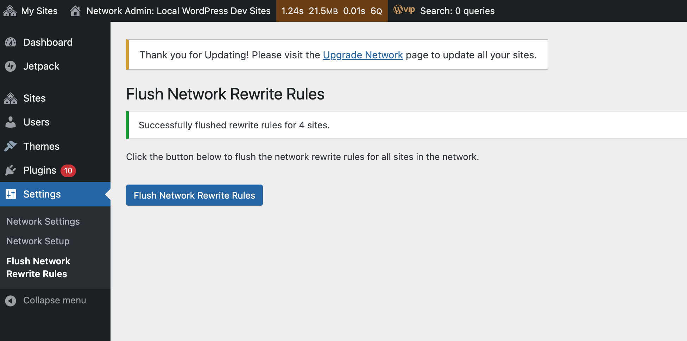

# WP Multisite Flush Rewrites

[](https://github.com/alleyinteractive/wp-multisite-flush-rewrites/actions/workflows/all-pr-tests.yml)

Flush rewrite rules easily for all sites on a WordPress multisite.

## Installation

You can install the package via Composer:

```bash
composer require alleyinteractive/wp-multisite-flush-rewrites
```

## Usage

Activate the plugin in WordPress and flush the network's rewrite rules in the
Network Admin Panel:



You can also flush the rewrite rules with WP-CLI:

```bash
wp multisite-flush-rewrites
wp multisite-flush-rewrites --network-id=2
```

The plugin flushes the rewrite rules for all non-archived sites in a network by
making an `admin-ajax.php` request to each site. This ensures that the rewrite
rules are properly refreshed and any changes are applied across the network.

## Changelog

Please see [CHANGELOG](CHANGELOG.md) for more information on what has changed recently.

## Credits

This project is actively maintained by [Alley
Interactive](https://github.com/alleyinteractive). Like what you see? [Come work
with us](https://alley.com/careers/).

- [Sean Fisher](https://github.com/srtfisher)
- [All Contributors](../../contributors)

## License

The GNU General Public License (GPL) license. Please see [License File](LICENSE) for more information.
